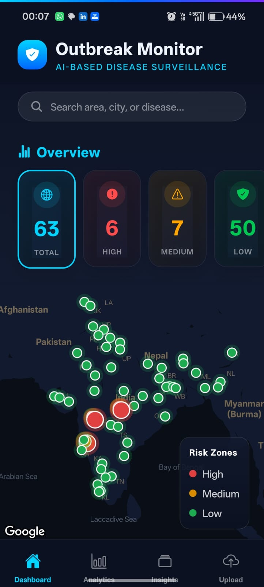
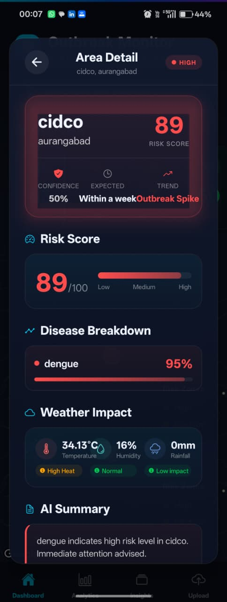
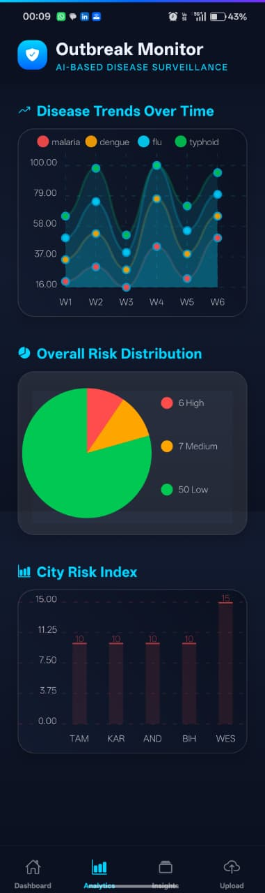
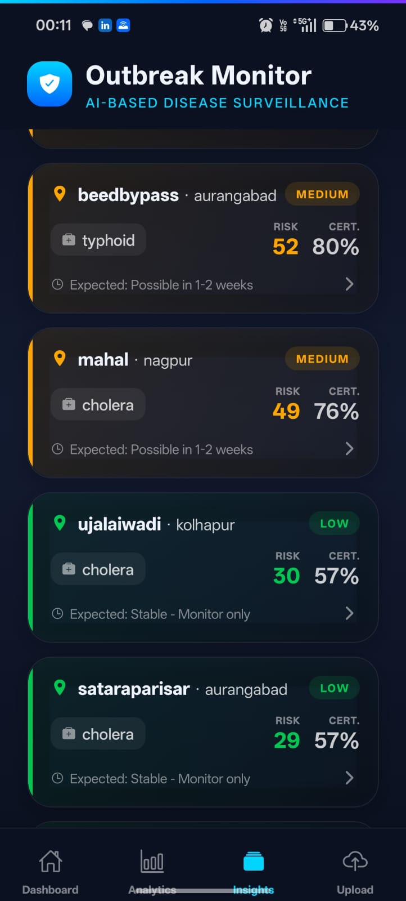
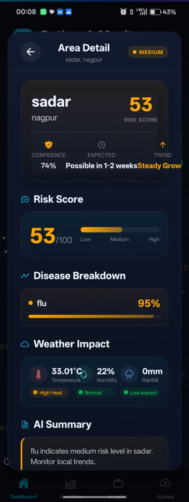
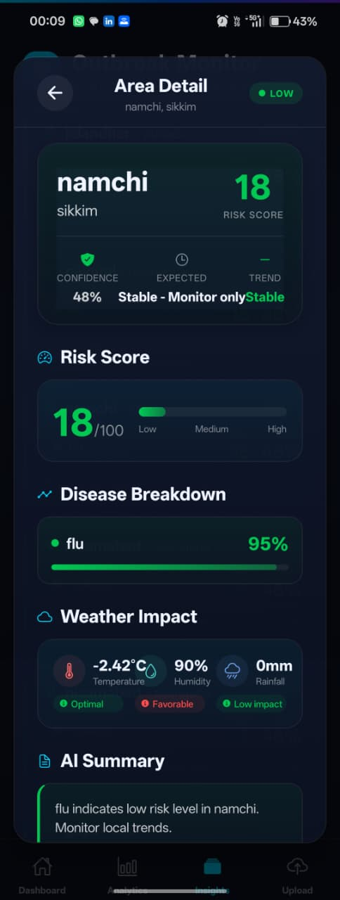
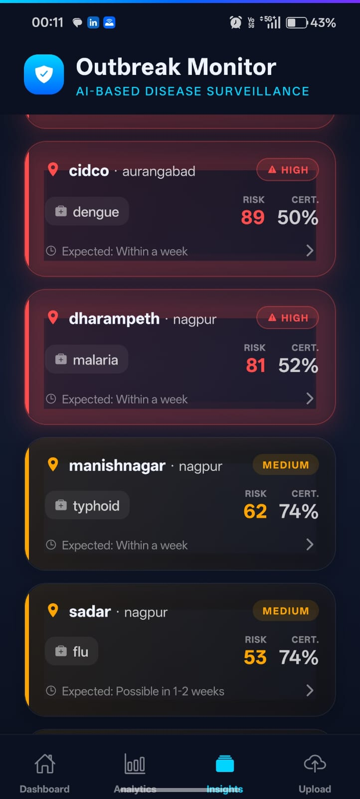
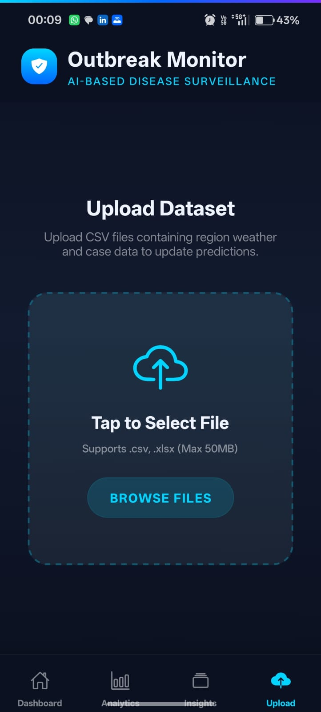
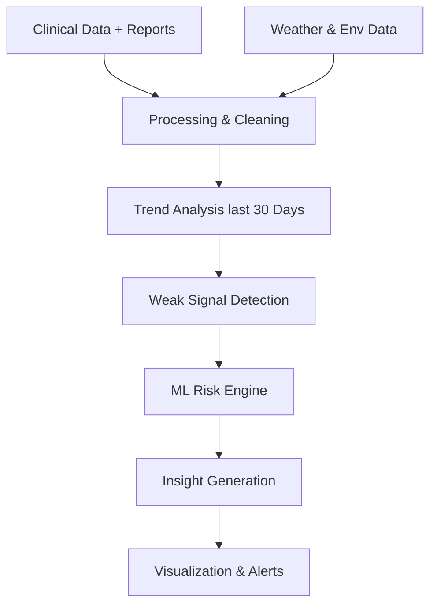

# 🌍 AegisEpi

A high-fidelity, production-grade disease monitoring and risk prediction platform.  
This system leverages Machine Learning to analyze historical outbreak data, weather patterns, and real-time reports to provide **actionable insights for public health officials and the general public**.

Unlike traditional systems, it focuses on detecting **early weak signals** — identifying outbreaks *before they become obvious*.

---

## 📱 Mobile Implementation (Screenshots)

### 📊 Dashboard & Map
| Dashboard | Risk Map |
|:----------:|:----------:|
|  |  |

---

### 📈 Analytics & Trends
| Analytics | Trends |
|:----------:|:--------:|
|  |  |

---

### 📍 Risk Levels
| 🔥 High Risk | ⚠️ Medium Risk | ✅ Low Risk |
|:----------:|:-------------:|:----------:|
|  |  |  |

---

### 📌 Area Details & Insights
| Detail View 1 | Detail View 2 | Detail View 3 |
|:---------------:|:----------------:|:--------------:|
|  |  |  |

---

### 📤 Data Upload
| 📁 Upload Dataset |
|:---------------:|
|  |

---

## ❗ Problem Statement

Most current outbreak detection systems:
- **Reactive, not Proactive**: Depend on confirmed hospital data which is often delayed.
- **Late Detection**: Outbreaks are identified only after significant community spread.
- **Data Silos**: Lack of integration between environmental factors and clinical data.

👉 **This platform bridges the gap by detecting early signals before they escalate into crises.**

---

## 💡 Our Approach

Instead of waiting for large spikes, the system analyzes "Silent Signals":
- **Micro-Trends**: Gradual increases in symptoms or cases over 7–14 days.
- **Environmental Context**: Real-time integration of humidity, rainfall, and temperature data.
- **Pattern Recognition**: Regional disease patterns compared against historical baselines.

---

## ⚙️ Key Features

### 1️⃣ Real-time Risk Engine
- AI-powered predictions using **Random Forest** and **Gradient Boosting** models.
- Dynamic risk scoring (Low / Medium / High) updated as new data flows in.
- Explainable risk factors (Weather + Growth + Volume).

### 2️⃣ Geographic Intelligence
- Interactive maps with outbreak clusters and hyperlocal risk detection.
- Seamless navigation between global, regional, and area-specific data.

### 3️⃣ Advanced Analytics
- Time-series tracking for multiple pathogens (Dengue, Malaria, Flu, etc.).
- Comparative analysis of current trends against historical seasonal averages.

### 4️⃣ Data Management
- Secure CSV / Excel upload support for rapid data ingestion.
- Automated cleaning and normalization of clinical reports.

---

## 🧠 Core Concept

> **"Detecting the invisible before it becomes inevitable."**

---

## 🛠 Technology Stack

### 📱 Frontend (Mobile)
- **Framework**: React Native (Expo)
- **UI/UX**: Premium Glassmorphic Design System
- **Visualization**: `react-native-chart-kit`, `react-native-svg`
- **Mapping**: `react-native-maps`

### 🌐 Web Dashboard
- **Framework**: React.js (Vite)
- **Charts**: `Chart.js` / `Recharts`
- **Styling**: Tailwind CSS / Modern CSS Variables

### ⚙️ Backend & API
- **Runtime**: Node.js / Express.js
- **Database**: MongoDB (Atlas)
- **Architecture**: RESTful API with automated geocoding services.

### 🧠 Machine Learning
- **Language**: Python
- **Library**: Scikit-learn
- **Models**: Random Forest Regressor, Gradient Boosting
- **Serving**: Flask / FastAPI microservice

### 🌍 External Services
- **Weather Data**: OpenWeather / WeatherStack API
- **Geocoding**: OpenCage / Nominatim API

---

## ⚙️ System Flow



---

## 📁 Project Structure

```bash
├── Backend/           # Express server, API controllers, and DB services
├── mobile-app/        # React Native source code (iOS/Android)
├── ml/               # Python ML models and prediction engine
├── frontend/          # React.js web dashboard
└── screenshots/       # Visual documentation of the implementation
```

---

## 🚀 Getting Started

### 1. Backend Setup
```bash
cd Backend
npm install
npm start
```

### 2. Mobile App Setup
```bash
cd mobile-app
npm install
npx expo start
```

### 3. ML Service Setup
```bash
cd ml
pip install -r requirements.txt
python server.py
```

---

## 👥 The Team

- **Yashashri Rajput**
- **Tejas Kulkarni**
- **Samruddhi Patil**

---

## 💡 Future Roadmap
- [ ] **Real-time Integration**: Direct hooks into hospital management systems.
- [ ] **Push Alerts**: Geofenced notifications for high-risk zones.
- [ ] **Deep Learning**: Implementing LSTM models for better time-series forecasting.
- [ ] **Multi-Agent AI**: Specialized agents for pandemic simulation.

---
*Developed as part of the AI-Based Disease Outbreak Prediction System Project.*
